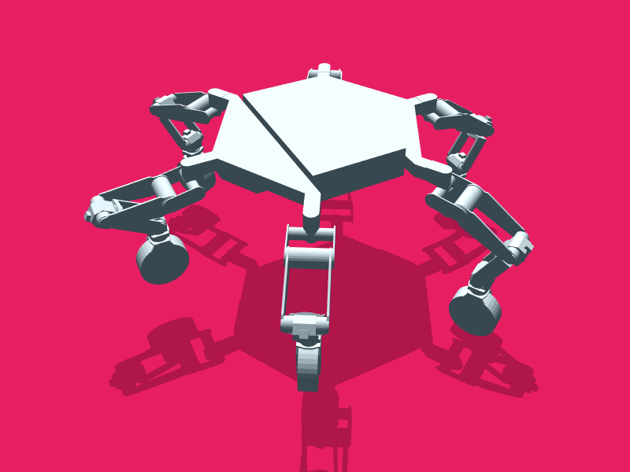

# javascript urdf-loader

Utilities for loading URDF files into THREE.js and a Web Component that loads and renders the model



## Running the Example

Install Node.js and NPM

Run `npm install`

Run `npm run server`

Visit `localhost:9080/javascript/example/` to view the page

## URDFLoader
```html
<script src=".../URDFLoader.js"></script>
<script>
  URDFLoader.load(
    '.../package/dir/',           // URDF's package:// directory
    'T12/urdf/T12.URDF',          // The path to the URDF in the package
    robot => { },                 // The robot is loaded!
    (path, ext, done) => { },     // Callback for each mesh for custom mesh processing and loading code
   )
</script>
```

### API
#### URDFLoader.load(package, urdfpath, robotsCallback, geometryLoader)

Loads and builds the specified URDF robot in THREE.js

##### package

_required_

The path representing the `package://` directory to loat `package://` relative files.

##### urdfpath

_required_

The path to the URDF file relative to the specified package directory.

##### robotsCallback(robots)

_required_

Callback that is called once the urdf robots have been loaded. An array of loaded robots is passed to the function.

##### geometryLoader(pathToModel, fileExtension, doneCallback)

_optional_

A optional function that can be used to override the default mesh loading functionality. The default loader is specified at `URDFLoader.defaultMeshLoader`. `doneCallback` is called with the mesh once the geometry has been loaded.

## urdf-viewer Element
```html
<!-- Register the Element -->
<script href=".../urdf-viewer-element.js" />
<script>customElements.define('urdf-viewer', URDFViewer)</script>

<body>
  <urdf-viewer package=".../package/dir/" urdf="T12/urdf/T12.URDF" up="Z+" display-shadow ambient-color="red"></urdf-viewer>
</body>
```

### Attributes

#### package

Corresponds to the `package` parameter in `URDFLoader.load`.

#### urdf

Corresponds to the `urdfpath` parameter in `URDFLoader.load`.

#### up

The axis to associate with "up" in THREE.js. Values can be [+-][XYZ].

#### display-shadow

Whether or not the render the shadow under the robot.

#### ambient-color

The color of the ambient light specified with css colors.

### Properties

All of the above attributes have corresponding camel case properties.

#### angles

Sets or gets the angles of the robot as a dictionary of `joint-name` to `radian` pairs.

### Functions

#### setAngle(jointName, angle)

Sets the given joint to the provided angle in radians.

#### setAngles(jointDictionary)

Sets all joint names specified as keys to radian angle value.

# LICENSE

The software is available under the [Apache V2.0 license](../LICENSE.txt).

Copyright © 2018 California Institute of Technology. ALL RIGHTS
RESERVED. United States Government Sponsorship Acknowledged. Any 
commercial use must be negotiated with with Office of Technology 
Transfer at the California Institute of Technology. This software may 
be subject to U.S. export control laws. By accepting this software, 
the user agrees to comply with all applicable U.S. export laws and 
regulations. User has the responsibility to obtain export licenses, 
or other export authority as may be required before exporting such 
information to foreign countries or providing access to foreign 
persons. Neither the name of Caltech nor its operating division, the
Jet Propulsion Laboratory, nor the names of its contributors may be
used to endorse or promote products derived from this software 
without specific prior written permission.
